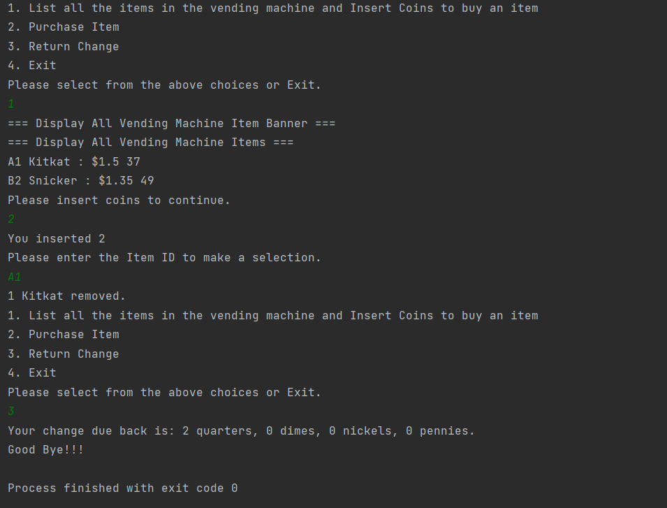

# Java Vending Machine System

This Java Vending Machine System project, developed in Fall 2021, showcases my early exploration into Java and object-oriented programming. At the time, I had minimal exposure to Java, but was eager to apply my learning in a practical way. The system simulates a real-world vending machine, with features such as item listing, coin insertion, item purchase, and change return.

## Features

- List all items in the vending machine with their prices and inventory status.
- Insert coins to make a purchase.
- Select an item by providing its ID.
- Purchase an item, deducting its inventory count and returning the appropriate change.
- Retrieve the change due to the user.
- Error handling for insufficient funds or unavailable items.

## Technologies Used

- Java
- Spring Framework
- JUnit

## Getting Started

To get started with the Vending Machine System, follow these steps:

1. Clone the repository: `git clone https://github.com/your-username/vending-machine.git`
2. Open the project in your preferred Java IDE.
3. Build the project to resolve dependencies.
4. Run the main application class to start the Vending Machine System.

## Usage

1. Follow the on-screen prompts to interact with the vending machine.
2. Use the menu options to list items, insert coins, make a purchase, or return change.
3. Provide the item ID when prompted to select an item for purchase.
4. Enter the required coins to complete the purchase.
5. The system will deduct the item from inventory and return the appropriate change.

## Testing

The project includes comprehensive unit tests to ensure the correctness and robustness of the Vending Machine System. The tests cover various scenarios, including adding items, purchasing items, and retrieving inventory.

To run the tests, use the testing framework integrated with your IDE or run the test classes manually.

## Contributing

Contributions to this Vending Machine System are welcome. If you find any issues or have suggestions for improvements, feel free to submit a pull request or open an issue in the repository.

## License

This project is licensed under the [MIT License](LICENSE).
